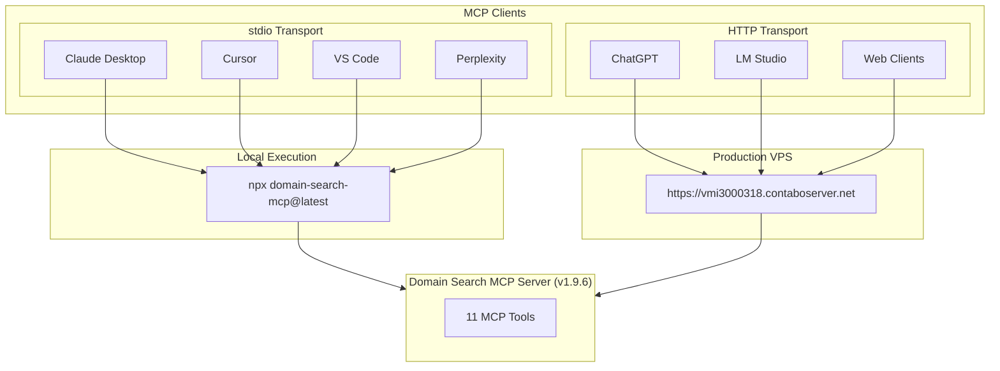
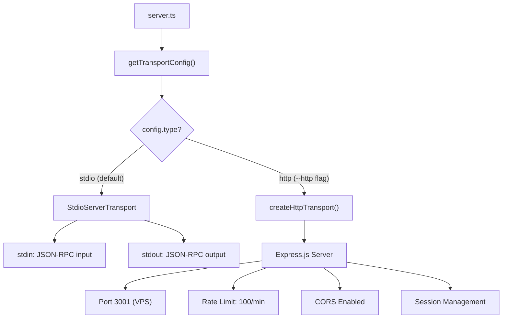
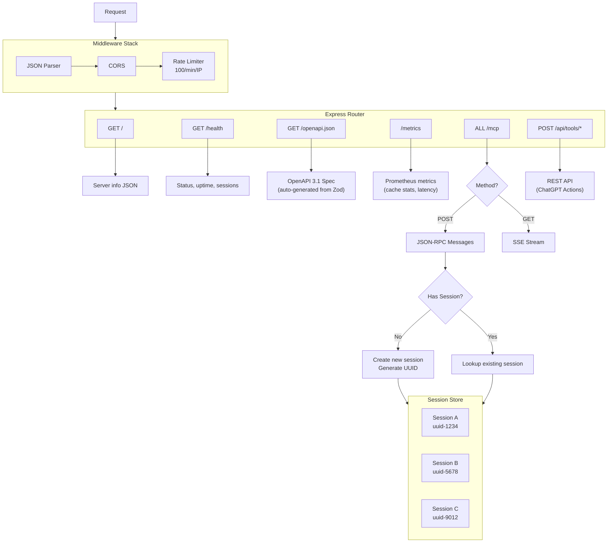
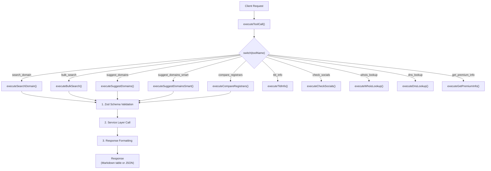
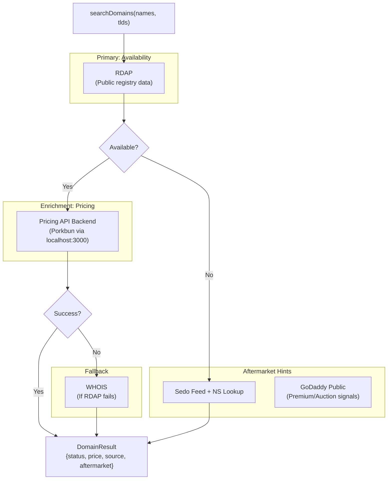
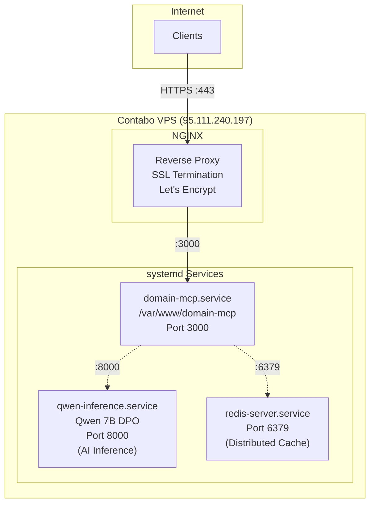
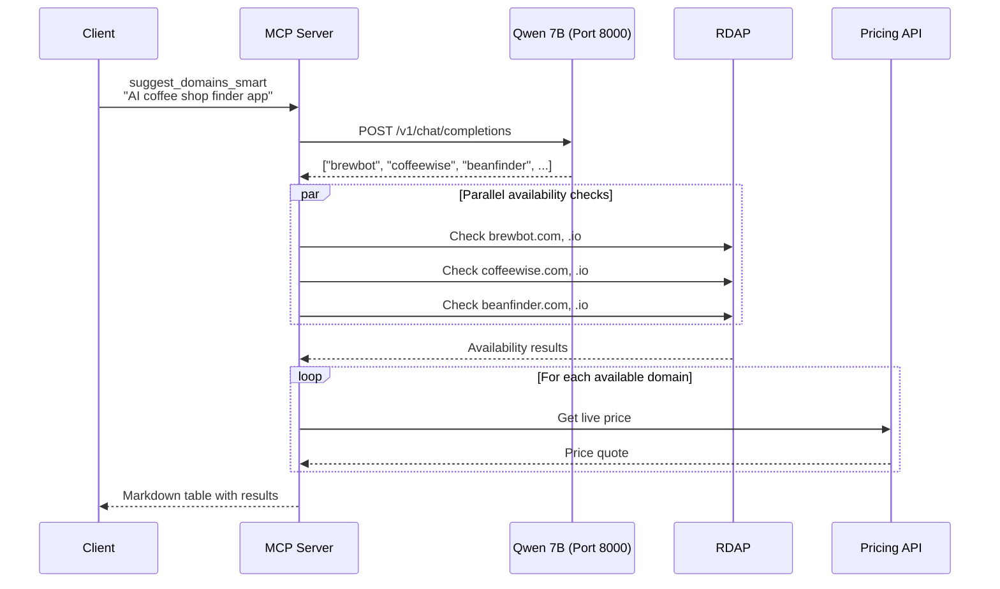
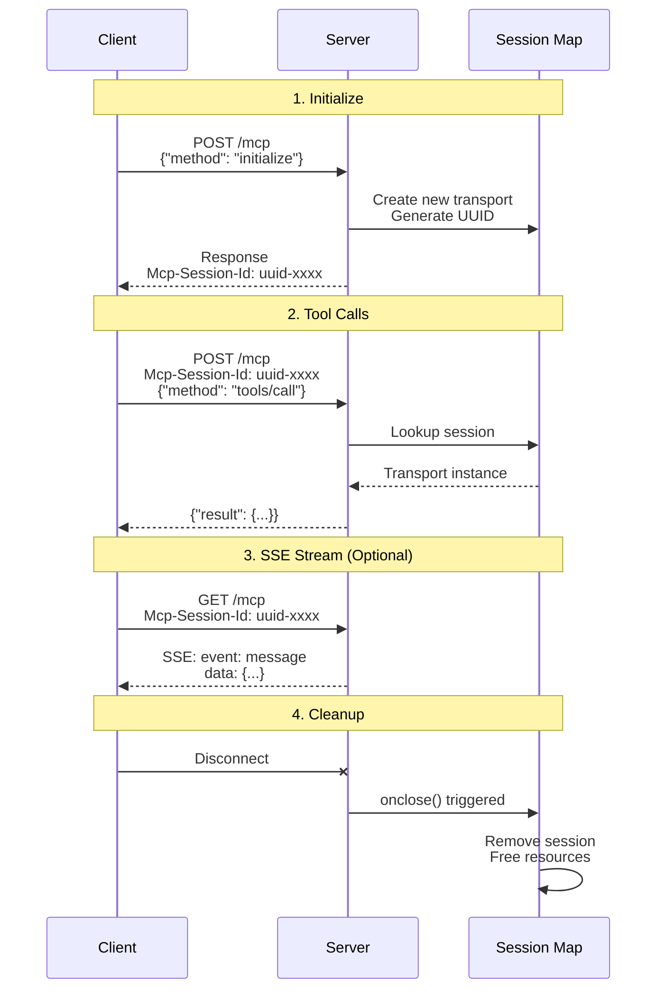

# Domain Search MCP - Architecture

This document provides detailed architectural diagrams for the Domain Search MCP server.

## Table of Contents

- [High-Level Overview](#high-level-overview)
- [Transport Layer](#transport-layer)
- [HTTP Transport Details](#http-transport-details)
- [Tool Execution Flow](#tool-execution-flow)
- [Data Source Waterfall](#data-source-waterfall)
- [VPS Deployment](#vps-deployment)
- [AI Suggestion Flow](#ai-suggestion-flow)
- [MCP Session Lifecycle](#mcp-session-lifecycle)
- [Directory Structure](#directory-structure)

---

## High-Level Overview



---

## Transport Layer

The server supports two transport modes, selected at runtime:



**Environment Variables:**

| Variable | Default | Description |
|----------|---------|-------------|
| `MCP_TRANSPORT` | `stdio` | Transport mode |
| `MCP_PORT` | `3000` | HTTP server port |
| `MCP_HOST` | `0.0.0.0` | HTTP server bind address |
| `CORS_ORIGINS` | `*` | Allowed CORS origins |

---

## HTTP Transport Details



**Endpoints:**

| Method | Path | Description |
|--------|------|-------------|
| GET | `/` | Server info |
| GET | `/health` | Health check (bypasses rate limit) |
| GET | `/openapi.json` | OpenAPI 3.1 specification |
| GET | `/metrics` | Prometheus-compatible metrics |
| POST | `/mcp` | MCP JSON-RPC messages |
| GET | `/mcp` | MCP SSE stream |
| POST | `/api/tools/:name` | REST API for ChatGPT Actions |

---

## Tool Execution Flow



---

## Data Source Waterfall

The system uses multiple data sources in a waterfall pattern:



**Source Priority:**

1. **RDAP** - Fast, free, reliable availability data
2. **Pricing API** - Live Porkbun quotes, corrects RDAP false positives
3. **WHOIS** - Fallback when RDAP unavailable
4. **GoDaddy Public** - Premium/auction signals for `search_domain`
5. **Sedo Feed** - Aftermarket auction hints for taken domains

---

## VPS Deployment



**Service Configuration:**

| Service | Port | Purpose |
|---------|------|---------|
| `domain-mcp` | 3000 | MCP HTTP server |
| `qwen-inference` | 8000 | Qwen 7B AI inference |
| `redis-server` | 6379 | Distributed cache |

**Production URLs:**

- `https://vmi3000318.contaboserver.net` - Server info
- `https://vmi3000318.contaboserver.net/mcp` - MCP protocol
- `https://vmi3000318.contaboserver.net/openapi.json` - OpenAPI spec
- `https://vmi3000318.contaboserver.net/health` - Health check
- `https://vmi3000318.contaboserver.net/metrics` - Prometheus metrics

---

## AI Suggestion Flow

The `suggest_domains_smart` tool uses a fine-tuned Qwen 7B model:



---

## MCP Session Lifecycle



---

## Directory Structure

```
domain-search-mcp/
├── src/
│   ├── server.ts                 # Entry point, transport selection
│   │
│   ├── transports/
│   │   ├── index.ts              # TransportConfig, getTransportConfig()
│   │   └── http.ts               # Express server, session management
│   │
│   ├── tools/
│   │   ├── index.ts              # Export all tools
│   │   ├── search-domain.ts      # search_domain tool
│   │   ├── bulk-search.ts        # bulk_search tool
│   │   ├── suggest-domains.ts    # suggest_domains tool
│   │   ├── suggest-smart.ts      # suggest_domains_smart (AI)
│   │   └── ...                   # Other tools
│   │
│   ├── services/
│   │   ├── domain-search.ts      # Main orchestration layer
│   │   ├── pricing-api.ts        # Backend API client
│   │   └── qwen-inference.ts     # AI suggestion service
│   │
│   ├── registrars/
│   │   ├── base.ts               # RegistrarAdapter base class
│   │   ├── porkbun.ts            # Porkbun API adapter
│   │   ├── namecheap.ts          # Namecheap API adapter
│   │   └── godaddy-public.ts     # GoDaddy public endpoint
│   │
│   ├── fallbacks/
│   │   ├── rdap.ts               # RDAP availability check
│   │   └── whois.ts              # WHOIS fallback
│   │
│   ├── openapi/
│   │   ├── generator.ts          # OpenAPI 3.1 spec generator
│   │   └── schemas.ts            # Zod to OpenAPI registration
│   │
│   ├── api/
│   │   └── routes.ts             # REST API router (/api/tools/*)
│   │
│   └── utils/
│       ├── cache.ts              # TTL-based in-memory cache
│       ├── redis-cache.ts        # Hybrid Redis + in-memory cache
│       ├── circuit-breaker.ts    # Circuit breaker pattern
│       ├── adaptive-concurrency.ts # Dynamic batch sizing
│       ├── metrics.ts            # Prometheus metrics
│       ├── errors.ts             # Error types
│       └── validators.ts         # Input validation
│
├── docs/
│   ├── ARCHITECTURE.md           # This file
│   └── MULTI_PLATFORM_EXPANSION.md
│
└── package.json                  # v1.9.6
```

---

## Key Design Decisions

1. **Dual Transport Architecture**: Same tool code serves both stdio and HTTP clients - no code duplication.

2. **Waterfall Data Sources**: RDAP → Pricing API → WHOIS chain ensures fast results with pricing enrichment.

3. **Session-based HTTP**: Each HTTP client gets isolated session with automatic cleanup on disconnect.

4. **Rate Limiting Strategy**: Global HTTP rate limiting (100/min) protects against abuse while per-registrar limits protect API quotas.

5. **OpenAPI Auto-generation**: Schemas defined once in Zod, automatically converted to OpenAPI 3.1 for ChatGPT Actions compatibility.

6. **Hybrid Caching**: Redis as primary cache with automatic fallback to in-memory. Circuit breaker pattern prevents Redis failures from affecting availability.

7. **Circuit Breaker Pattern**: All external services (Redis, AI inference) protected by circuit breakers with exponential backoff and automatic recovery.

8. **Adaptive Concurrency**: AI inference dynamically adjusts batch size and parallelism based on response latency percentiles.
